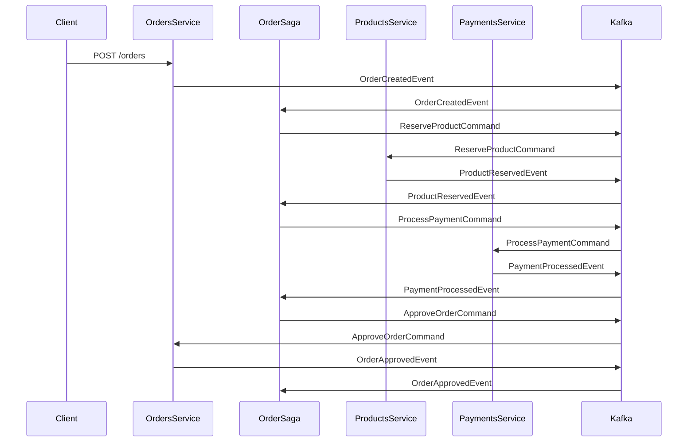

# saga-pattern-spring-boot-demo
Demonstration of SAGA Orchestration Design Pattern using Spring Boot and Kafka
## Saga Orchestration Flow

```mermaid
sequenceDiagram
    participant Client
    participant OrdersService
    participant OrderSaga
    participant ProductsService
    participant PaymentsService
    participant Kafka

    Client->>OrdersService: POST /orders

    OrdersService->>Kafka: OrderCreatedEvent
    Kafka->>OrderSaga: OrderCreatedEvent

    OrderSaga->>Kafka: ReserveProductCommand
    Kafka->>ProductsService: ReserveProductCommand

    ProductsService->>Kafka: ProductReservedEvent
    Kafka->>OrderSaga: ProductReservedEvent

    OrderSaga->>Kafka: ProcessPaymentCommand
    Kafka->>PaymentsService: ProcessPaymentCommand

    PaymentsService->>Kafka: PaymentProcessedEvent
    Kafka->>OrderSaga: PaymentProcessedEvent

    OrderSaga->>Kafka: ApproveOrderCommand
    Kafka->>OrdersService: ApproveOrderCommand

    OrdersService->>Kafka: OrderApprovedEvent
    Kafka->>OrderSaga: OrderApprovedEvent
```